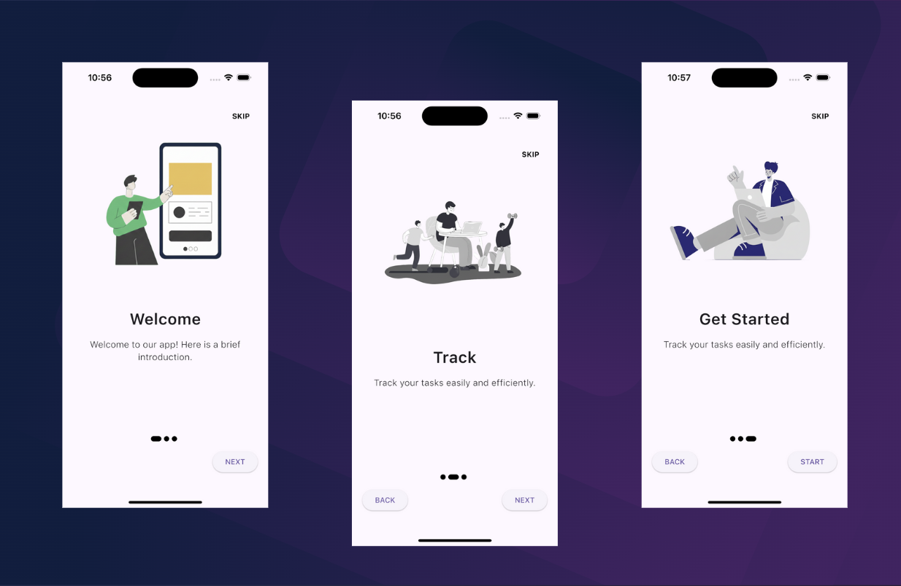

[](https://buymeacoffee.com/devthantziq)
Flutter Onboarding Screen

#UI



#Description:
-------------
A Flutter onboarding screen with multiple slides featuring:

- Top-right SKIP button
- Bottom BACK / NEXT / START buttons
- Dot indicators showing current page
- Scrollable description text for long content
- Saves onboarding completion state using SharedPreferences

Folder Structure:
-----------------
```
lib/
├── data/
│   └── onboarding.dart
├── ui/
│   ├── onboarding/
│   │   ├── onboarding_screen.dart
│   │   ├── onboarding_content.dart
│   │   ├── dot_indicator.dart
│   ├── home/
│   │   ├── home_page.dart
└── main.dart
```

Usage:
------
- On first launch, the onboarding screen will show.
- Swipe left/right or use NEXT / BACK buttons to navigate.
- Use SKIP to jump to the last slide.
- Press START to complete onboarding; the state is saved with SharedPreferences.
- On next app launch, onboarding will not be shown again.

Notes:
------
- OnboardingContent widget handles scrollable description text.
- DotIndicator widget dynamically highlights the current page.
- PageView automatically supports swipe gestures.
- Buttons use smooth transitions with animated curves.
- Works well for long descriptions and varying screen sizes.

Author:
-------
Thant Zin

Copyright (©️) 2025 Thant Zin
